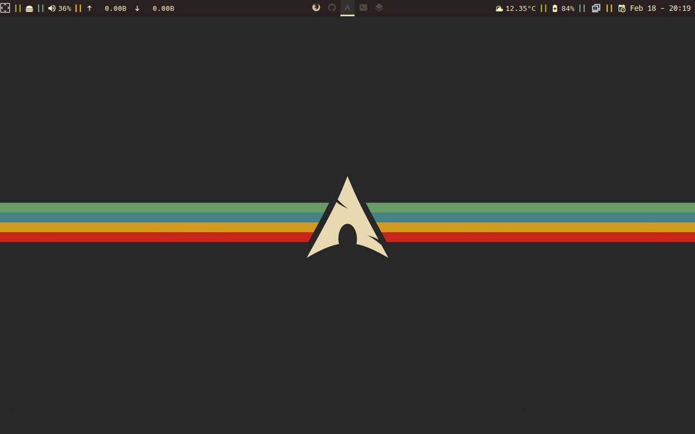
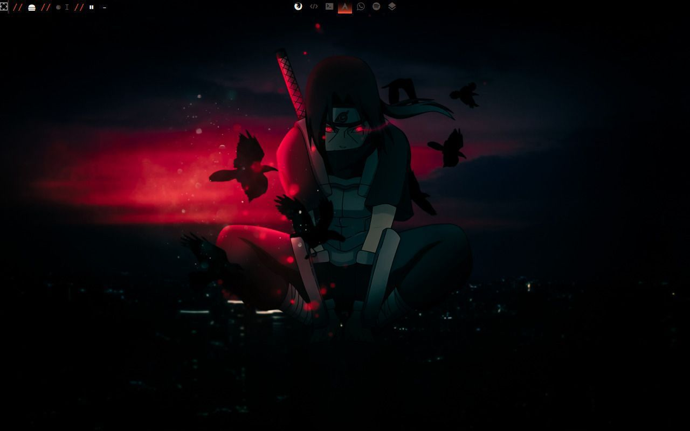

# Dotfiles / Feb 14 2023 - Mar 14 2023


🇲🇽  [ Versión en español](/README_es.md)

These are the dotfiles for my Arch Linux

# Table of Contents

- [Arch Installation](#arch-installation)
- [Packages](#packages)
  - [With custom config](#with-custom-config)
  - [Without custom config](#without-custom-config)
- [Basic sys utils](#basic-sys-utils)
- [Qtile](#qtile)
- [BlackArch repo](#blackarch-repo)
- [Configs in detail](#configs-in-detail)


## Packages

### With custom config

#### GUI
| Application |       Use         | Source |
|:-----------:|      :----:       | :---: |
| [qtile](http://docs.qtile.org/en/stable/ "Qtile docs") | Window manager | Pacman | 
|[alacritty](https://github.com/alacritty/alacritty "Alacritty's Github page") | Terminal emulator (vanilla)| Pacman |
|[VSCode (code)](https://code.visualstudio.com/docs "VSCode docs") | code editor | AUR |
| [lightdm](https://wiki.archlinux.org/title/LightDM "LightDM's arch entry") | login manager | Pacman |
| obsidian | note-taking app | AUR |
| neovim | text editor | Pacman |
| rofi | launcher |
| spectacle | screenshot utility |
| ly | Display Manager |


#### Terminal based
| Application |       Use         |
|:-----------:|      :----:       |
| [ picom ](https://wiki.archlinux.org/title/picom "Picom's Arch entry") | compositor |
| lightdm-gtk-greeter | default cfg for lightdm |
| lightdm-webkit2-greeter | thing for theming lightdm |
| [ yay ](https://github.com/Jguer/yay "Yay's GitHub repo") | package installer for the AUR |
| [neofetch ](https://github.com/dylanaraps/neofetch/wiki "Neofetch's wiki") | displays system info
| zsh | new shell intepreter
| oh-my-zsh | better zsh |
| starship | prompt editor |
| dunst | Notification manager? |

### Without custom config

#### GUI

| Application |       Use         |
|:-----------:|      :----:       |
| firefox |  web browser |
| pavucontrol | sound manager |
| discord | self expl. |
| arandr | Graphical Screen Manager |
| simplescreenrecorder | Records Screen |
| eww | Wacky widgets |
| bitwarden | Password manager |
| todoist | Todo-list app |
| lxappearance | Changing system theme |
| qt5ct | Same that lxappearance |
| Apostrophe | MD editor |


#### Terminal based

| Application |       Use         |
|:-----------:|      :----:       |
| htop | ram? viewer |
| lsd | a better ls |
| bat | a better cat |
| unzip | self exp. |
| python-pip | library installer for python |
| feh | wallpaper manager |
| scrot | utility for taking screenshots |
| xcalib | icc manager |
| brightnessctl | self explanatory |
| imv | image preview tool |
| papirus-icon-theme | self exp. |
| rustup | compiler for rust |
| snap | package installer |
| xdg-utils | manage XDG MIME apps |
| toipe | typing test |
| spotify-tui | spotify on terminal |
| spotifyd | spotify client |
| lunarvim | nvim ide? |
| nodejs | [ check this ](https://www.atlantic.net/dedicated-server-hosting/how-to-install-and-use-node-js-on-arch-linux/)


## Qtile

### Aviable themes

#### Cyberpunk

_No preview available_

#### Gruvbox



#### Focus Theme



### Apps used in the config file:

_Note: before you copy the qtile config make sure you have **alacritty** installed_

Install the hack nerd font from [here](https://www.nerdfonts.com/font-downloads), unzip it and move it to: /usr/share/fonts


*Note: If you use a different terminal, change it in ~/.config/qtile/settings/keys.py on `my_terminal = alacritty`*

### Pip dependencies 

```bash
pip install psutil dbus-next
```

## BlackArch repo

### A little guide about how to install the blackarch repo

- Install curl (if not installed)

``` bash
sudo pacman -S curl
```

- Download the setup script using:

``` bash
curl -O https://blackarch.org/strap.sh
```

- Give execution privileges and run it with sudo:

``` bash
chmod +x strap.sh
sudo ./strap.sh
rm strap.sh
```

#### List everything from the repo

``` bash
pacman -Sgg | grep blackarch | cut -d ' ' -f2 | sort -u
```

#### List all blackarch categories

``` bash
pacman -Sg | grep blackarch | sed 's/blackarch-/ /'
```

#### Install a whole category

``` bash
sudo pacman -S blackarch-category
```

# Configs in detail

- [Neovim](#neovim)
- [Zsh](#zsh)
- [Yay](#yay)
- [Git](#git)

## Neovim

Im using the lunarivm config, you can find the installation guide [here](https://www.lunarvim.org/docs/installation)

_Note: install xsel for nvim_ 


## Zsh

### OhMyZsh's Plugins

#### Default

- git
- archlinux
- command-not-found
- rust

#### Custom 

- zsh-syntax-highlighting
- zsh-autosuggestions


## Eww

### Install guide

1. Install rustup

```bash
curl --proto '=https' --tlsv1.2 -sSf https://sh.rustup.rs | sh
```

2. Clone eww github's repo

```bash
git clone https://github.com/elkowar/eww
```

```bash
cd eww
```

3. Build it

```bash
cargo build --release
```

Build for wayland:

```bash
cargo build --release --no-default-features --features=wayland
```

## Yay

### Short install guide 

``` bash
cd /opt
sudo git clone https://aur.archlinux.org/yay-git.git
sudo chown -R yourUser:yourUser ./yay-git
cd yay-git
makepkg -si
```

## Git

### Set up git with: 

``` bash
git config --global user.email "you@example.com"  
```

```bash
git config --global user.name "Your Name"
```

``` bash
git config --global init.defaultBranch <name>
```

## Todoist

### You have to have configured a default desktop, here's little guide about how to do it on Arch

#### Install xdg-utils

```bash
sudo pacman -S xdg-utils
```

#### Run this commands _(if you use something else than firefox, change it)_

```bash
xdg-mime query default x-scheme-handler/http
firefox
xdg-settings get default-web-browser
firefox
```
