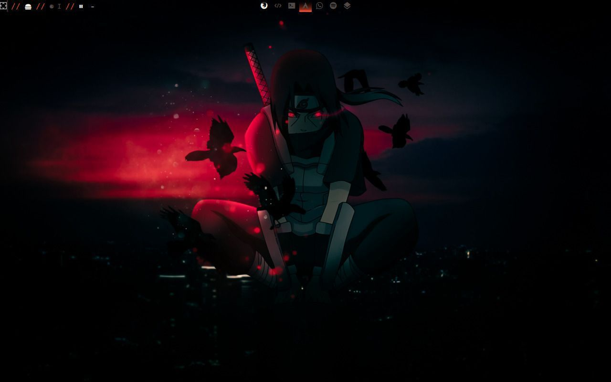

# Dotfiles / 14 de febrero de 2023 - 14 de marzo de 2023

🇲🇽 [Versión en inglés](/README.md)

## Notes

- Estos eran mis dotfiles de ArchLinux + Xorg, no recomendaría usarlos tal como están, ya que están muy desactualizados y probablemente rotos.

- Esta fue mi primera vez estando en linux así que hay muchas cosas mal hechas.

- Como no pienso volver a usar Xorg para uso personal estos dotfiles están muy obsolteos así que archivaré el repositorio indefinidamente. 

## Tabla de Contenidos

- [Guía para instalar Arch (en inglés)](https://github.com/m0r4a/ArchLinux-install-guide)
- [Paquetes](#paquetes)
  - [Con configuración personalizada](#con-configuración-personalizada)
  - [Configuración predeterminada](#configuración-predeterminada)
- [Qtile](#qtile)
- [Repositorio BlackArch](#repositorio-blackarch)
- [Configuraciones detalladas](#configuraciones-detalladas)

### Paquetes

#### Con configuración personalizada

##### Interfaz Gráfica (GUI)
| Aplicación | Uso | Origen |
|:-----------:|:----:|:---:|
| [qtile](http://docs.qtile.org/en/stable/ "Documentación de Qtile") | Gestor de ventanas | Pacman | 
|[alacritty](https://github.com/alacritty/alacritty "Página de Github de Alacritty") | Emulador de terminal (original)| Pacman |
|[VSCode (code)](https://code.visualstudio.com/docs "Documentación de VSCode") | editor de código | AUR |
| [lightdm](https://wiki.archlinux.org/title/LightDM "Entrada de LightDM en ArchWiki") | gestor de inicio de sesión | Pacman |
| obsidian | aplicación de toma de notas | AUR |
| neovim | editor de texto | Pacman |
| rofi | lanzador |
| spectacle | utilidad de captura de pantalla |
| ly | Gestor de pantalla |

##### Solo Terminal
| Aplicación | Uso |
|:-----------:|:----:|
| [ picom ](https://wiki.archlinux.org/title/picom "Entrada de Picom en ArchWiki") | compositor |
| lightdm-gtk-greeter | configuración predeterminada para lightdm |
| lightdm-webkit2-greeter | cosa para temas de lightdm |
| [ yay ](https://github.com/Jguer/yay "Repositorio de GitHub de Yay") | instalador de paquetes para AUR |
| [neofetch ](https://github.com/dylanaraps/neofetch/wiki "Wiki de Neofetch") | muestra información del sistema |
| zsh | nuevo intérprete de shell |
| oh-my-zsh | mejor zsh |
| starship | editor de indicador |
| dunst | 쮾estor de notificaciones? |

#### Configuración predeterminada

##### Interfaz Gráfica (GUI)

| Aplicación | Uso |
|:-----------:|:----:|
| firefox | navegador web |
| pavucontrol | gestor de sonido |
| discord | pues, discord |
| arandr | GUI para xrandr |
| simplescreenrecorder | Graba la pantalla |
| eww | Widgets elegantes |
| bitwarden | Gestor de contraseñas |
| todoist | Aplicación de lista de tareas |
| lxappearance | Cambiar el tema del sistema |
| qt5ct | Igual que lxappearance |
| Apostrophe | Editor de MD |

##### Solo Terminal

| Aplicación | Uso |
|:-----------:|:----:|
| htop | visor de RAM |
| lsd | un ls mejor |
| bat | un cat mejor |
| unzip | se entende fácil |
| python-pip | instalador de bibliotecas para python |
| feh | gestor de fondos de pantalla |
| scrot | utilidad para tomar capturas de pantalla |
| xcalib | para cambiar el perfil de colores de la pantalla |
| brightnessctl | controla el brillo |
| imv | herramienta de vista previa de imágenes |
| papirus-icon-theme | se entiende |
| rustup | compilador para rust |
| snap | instalador de paquetes |
| xdg-utils | administrar aplicaciones XDG MIME |
| toipe | prueba de escritura |
| spotify-tui | spotify en terminal |
| spotifyd | cliente de spotify |
| lunarvim | 쯀DE de nvim? |
| nodejs | [mira esto](https://www.atlantic.net/dedicated-server-hosting/how-to-install-and-use-node-js-on-arch-linux/)

## Qtile

### Temas Disponibles

#### Gruvbox


#### Focus



#### Cyberpunk

_Sin vista previa_

### Aplicaciones utilizadas en el archivo de configuración:

_Nota: antes de copiar la configuración de qtile, asegúrate de tener instalado **alacritty**_

Instala la nerdfont "Hack" de [aquí](https://www.nerdfonts.com/font-downloads), descomprímela y muévela a: /usr/share/fonts

*Nota: Si utilizas un terminal diferente, cámbialo en ~/.config/qtile/settings/keys.py en `my_terminal = alacritty`*

### Dependencias de pip 

```bash
pip install psutil dbus-next
```

## Repositorio BlackArch

### Una pequeña guía sobre cómo instalar el repositorio blackarch

- Instala curl (si no está instalado)

```bash
sudo pacman -S curl
```

- Descarga el script de configuración con:

``` bash
curl -O https://blackarch.org/strap.sh
```

- Dale permisos de ejecución y ejecútalo con sudo:

```bash
chmod +x strap.sh
sudo ./strap.sh
rm strap.sh
```

#### Lista todo en el repositorio

```bash
pacman -Sgg | grep blackarch | cut -d ' ' -f2 | sort -u
```

#### Lista todas las categorías que tiene balackarch

```bash
pacman -Sg | grep blackarch | sed 's/blackarch-/ /'
```

#### Instala una categoría completa

```bash
sudo pacman -S blackarch-category
```

# Configuraciones detalladas

- [Neovim](#neovim)
- [Zsh](#zsh)
- [Eww](#eww)
- [Yay](#yay)
- [Git](#git)
- [Todoist](#todoist)

## Neovim

Estoy utilizando la configuración de lunarivm, puedes encontrar la guía de instalación [aquí](https://www.lunarvim.org/docs/installation)


_Nota: instalar xsel para nvim_


## Zsh

### Plugins de OhMyZsh

#### Predeterminados

- git
- archlinux
- command-not-found
- rust

#### Personalizados

- zsh-syntax-highlighting
- zsh-autosuggestions

## Eww

# Guía de instalación

1. Instala rustup

```bash

curl --proto '=https' --tlsv1.2 -sSf https://sh.rustup.rs | sh
```

2. Clona el repositorio de github de eww

```bash
git clone https://github.com/elkowar/eww
```

```bash
cd eww
```

3. Compílalo

```bash
cargo build --release
```

Compilación para wayland:

```bash
cargo build --release --no-default-features --features=wayland
```

## Yay

### Guía corta de instalación 

```bash
cd /opt
sudo git clone https://aur.archlinux.org/yay-git.git
sudo chown -R yourUser:yourUser ./yay-git
cd yay-git
makepkg -si
```

## Git

### Comandos para configurar git:

```bash
git config --global user.email "tu@ejemplo.com"  
```

```bash
git config --global user.name "Tu nombre"
```

```bash
git config --global init.defaultBranch <name>
```

## Todoist

### Debes haber configurado un navegador predeterminado, aquí tienes una pequeña guía sobre cómo hacerlo en Arch

#### Instala xdg-utils

```bash
sudo pacman -S xdg-utils
```

#### Ejecuta estos comandos (si usas algo diferente a firefox, cámbialo)

```bash
xdg-mime query default x-scheme-handler/http
firefox
xdg-settings get default-web-browser
firefox
```
